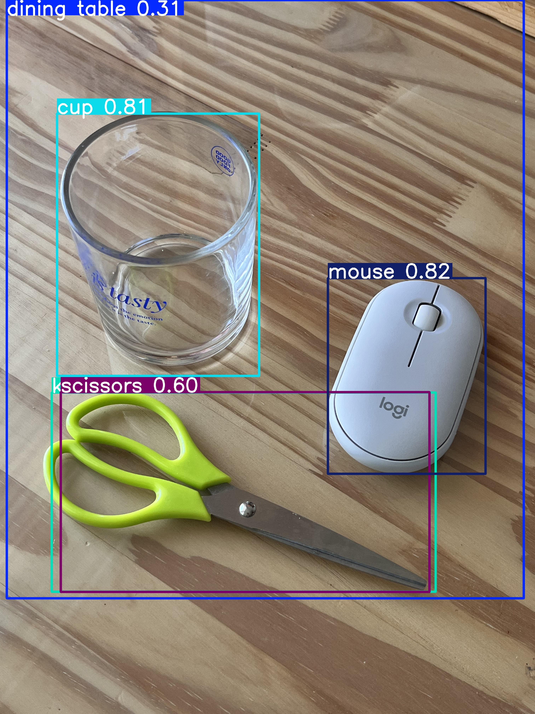
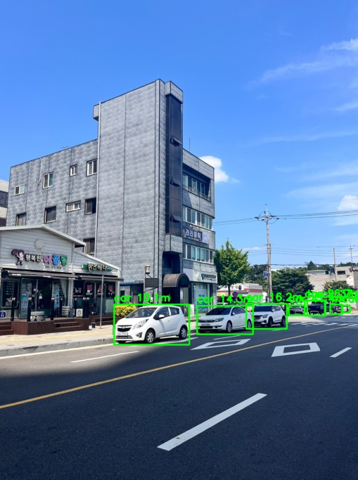
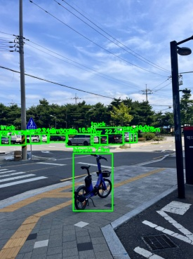

## jeonbot4-projects

### 과제 1 - yolov5 객체 감지 실습
- PyTorch와 yolov5를 사용하여 이미지 내 객체 탐지
- Google Colab에서 모델 로딩, 이미지 업로드, 결과 시각화까지 진행

-----

### 과제 2 - yolov5 거리 추정 실습
- PyTorch와 yolov5로 객체를 탐지하고, 바운딩 박스 크기를 이용해 실제 거리(cm) 추정
- 카메라 모델 : 핀홀 카메라 모델 기반 거리 추정 (원근법 고려)
- 거리 추정 방법 : 단안 카메라를 통한 객체 거리 추정

[거리(cm) = 실제높이(cm) x 초점거리(px) / 바운딩 박스 높이(px)]

  

  
